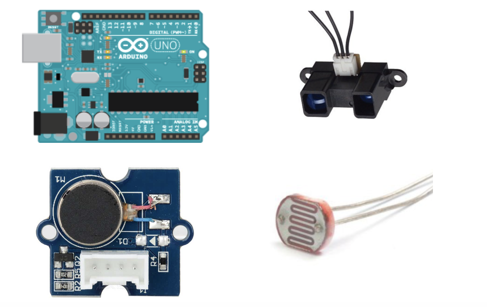
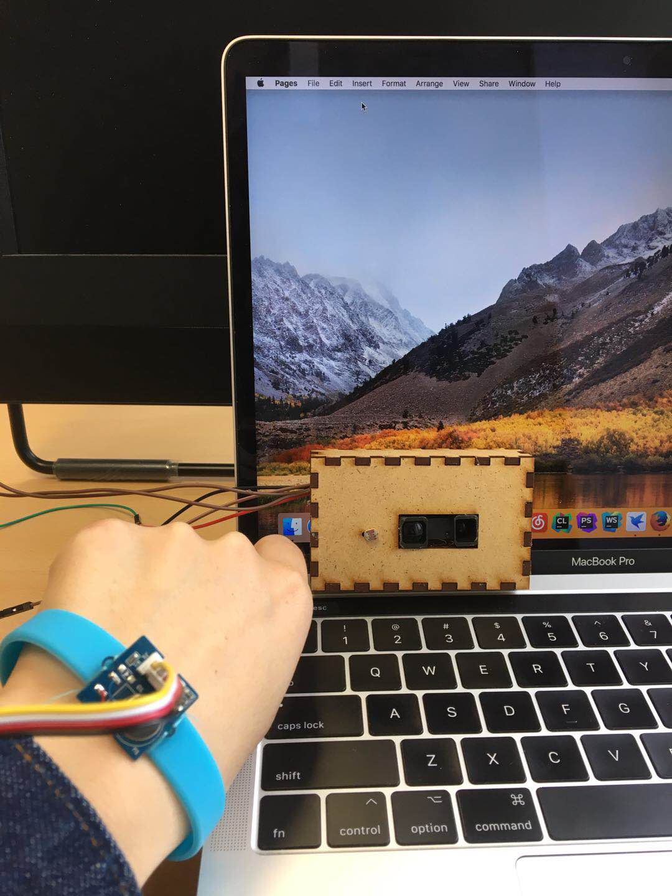

# yeuxProtecteur

##L'idée de départ
L’idée de notre projet vient de protecter les yeux d'utilisateurs d’ordi. car il abime les yeux si on est très près d’écran d'ordinateur ou la lumière de l'environnement est très claire. Quand les gens utilise l'ordinateur pas correctement, il va lancer un alarme et une vibration.

##La réalisation
Il y a 3 composants électroniques dans notre projet. Le premier est capteur infrarouge qui peut mesurer la distance entre les yeux et l'écran . Et le deuxième est un capteur de lumière, qui peut sentir l’intensité de la lumière. Et le dernier composant est un vibrateur qui peut vibrer s’il y a une alarm. Et on choisit 2 sons pour alarmer les utilisateurs. 

Cet équipement est install sur l’écran, et un bracelet avec un moteur vibration. Pendant l'utilisation, quand la distance entre les yeux et l’écran est très proche, processing va émet un son et le vibrateur va vibrer. Et si l’intensité de la lumière est très grande, il y a un autre son et le vibrateur va vibrer aussi.

